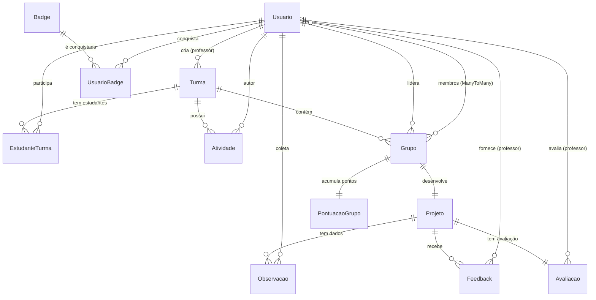

# 🗄️ DIAGRAMA DO BANCO DE DADOS - Ciência Cidadã

## 📊 DIAGRAMA ENTIDADE-RELACIONAMENTO (ER)



---

## 📋 TABELAS DO SISTEMA

### 1️⃣ **Usuario** (Usuários do Sistema)
Estende `AbstractUser` do Django, adicionando campos customizados.

| Campo | Tipo | Descrição |
|-------|------|-----------|
| **id** | Integer (PK) | ID único do usuário |
| **username** | String | Nome de usuário (login) |
| **email** | String | E-mail |
| **password** | String | Senha (criptografada) |
| **first_name** | String | Primeiro nome |
| **last_name** | String | Sobrenome |
| **tipo** | String | Tipo: `professor` ou `estudante` |
| **instituicao** | String | Instituição de ensino |
| **telefone** | String | Telefone de contato |
| **foto_perfil** | ImageField | Foto do perfil |
| **criado_em** | DateTime | Data de criação |
| **atualizado_em** | DateTime | Última atualização |

**Relacionamentos:**
- **1:N** → Turma (como professor criador)
- **1:N** → Atividade (como autor)
- **1:N** → Observacao (como coletor)
- **1:N** → Feedback (como professor)
- **1:N** → Avaliacao (como avaliador)
- **M:N** → Grupo (como membro via ManyToMany)
- **1:N** → Grupo (como líder)
- **1:N** → UsuarioBadge (badges conquistadas)

---

### 2️⃣ **Turma** (Turmas/Classes)
Criada por professores, onde estudantes se inscrevem.

| Campo | Tipo | Descrição |
|-------|------|-----------|
| **id** | Integer (PK) | ID único da turma |
| **nome** | String | Nome da turma |
| **descricao** | Text | Descrição detalhada |
| **professor_id** | Integer (FK) | Professor responsável → Usuario |
| **codigo_acesso** | String | Código único para entrada (8 caracteres) |
| **ano_semestre** | String | Ex: "2024.1", "2024/2" |
| **max_grupos** | Integer | Máximo de grupos permitidos |
| **max_membros_grupo** | Integer | Máximo de membros por grupo (2-10) |
| **ativa** | Boolean | Turma está ativa? |
| **criada_em** | DateTime | Data de criação |
| **atualizada_em** | DateTime | Última atualização |

**Relacionamentos:**
- **N:1** → Usuario (professor criador)
- **1:N** → Grupo (grupos da turma)
- **1:N** → EstudanteTurma (estudantes inscritos)
- **1:N** → Atividade (atividades da turma)

---

### 3️⃣ **Grupo** (Grupos de Trabalho)
Grupos de estudantes que trabalham juntos em projetos.

| Campo | Tipo | Descrição |
|-------|------|-----------|
| **id** | Integer (PK) | ID único do grupo |
| **nome** | String | Nome do grupo |
| **turma_id** | Integer (FK) | Turma à qual pertence → Turma |
| **lider_id** | Integer (FK) | Líder do grupo → Usuario |
| **criado_em** | DateTime | Data de criação |
| **atualizado_em** | DateTime | Última atualização |

**Relacionamentos:**
- **N:1** → Turma (pertence a uma turma)
- **M:N** → Usuario (membros do grupo via ManyToMany)
- **N:1** → Usuario (líder do grupo)
- **1:1** → Projeto (desenvolve um projeto)
- **1:1** → PontuacaoGrupo (pontuação acumulada)

**Constraint Único:** `(turma, nome)` - Nome único dentro da turma

---

### 4️⃣ **Projeto** (Projetos Científicos)
Projetos seguindo as 6 fases do método científico.

| Campo | Tipo | Descrição |
|-------|------|-----------|
| **id** | Integer (PK) | ID único do projeto |
| **titulo** | String | Título do projeto |
| **slug** | SlugField | Slug único para URL |
| **grupo_id** | Integer (FK) | Grupo responsável → Grupo |
| **area_ciencia** | String | Área: biologia, física, química, etc. |
| **descricao_breve** | Text | Resumo (até 500 caracteres) |
| **fase_atual** | Integer | Fase atual (1-6) |
| **status** | String | Status: rascunho, em_andamento, aguardando_aprovacao, concluido |
| | | |
| **Fase 1: Problema** | | |
| **fase1_pergunta** | Text | Pergunta de pesquisa |
| **fase1_justificativa** | Text | Justificativa |
| **fase1_objetivos** | Text | Objetivos |
| **fase1_aprovada** | Boolean | Fase aprovada? |
| **fase1_aprovada_em** | DateTime | Data de aprovação |
| | | |
| **Fase 2: Hipótese** | | |
| **fase2_hipotese_principal** | Text | Hipótese principal |
| **fase2_fundamentacao** | Text | Fundamentação teórica |
| **fase2_aprovada** | Boolean | Fase aprovada? |
| **fase2_aprovada_em** | DateTime | Data de aprovação |
| | | |
| **Fase 3: Metodologia** | | |
| **fase3_metodo_coleta** | Text | Método de coleta |
| **fase3_materiais** | Text | Materiais e ferramentas |
| **fase3_cronograma** | Text | Cronograma |
| **fase3_local** | String | Local da pesquisa |
| **fase3_aprovada** | Boolean | Fase aprovada? |
| **fase3_aprovada_em** | DateTime | Data de aprovação |
| | | |
| **Fase 4: Coleta** | | |
| **fase4_aprovada** | Boolean | Fase aprovada? |
| **fase4_aprovada_em** | DateTime | Data de aprovação |
| | | |
| **Fase 5: Análise** | | |
| **fase5_organizacao_dados** | Text | Organização dos dados |
| **fase5_interpretacao** | Text | Interpretação |
| **fase5_discussao** | Text | Discussão |
| **fase5_aprovada** | Boolean | Fase aprovada? |
| **fase5_aprovada_em** | DateTime | Data de aprovação |
| | | |
| **Fase 6: Conclusão** | | |
| **fase6_hipotese_confirmada** | String | sim, parcial, nao |
| **fase6_conclusao** | Text | Conclusão |
| **fase6_aprendizados** | Text | Aprendizados |
| **fase6_limitacoes** | Text | Limitações |
| **fase6_aprovada** | Boolean | Fase aprovada? |
| **fase6_aprovada_em** | DateTime | Data de aprovação |
| | | |
| **Anexos (Cloudinary)** | | |
| **relatorio_final** | FileField | Relatório (PDF/DOCX) |
| **apresentacao** | FileField | Apresentação (PPT/PDF) |
| **foto_equipe** | ImageField | Foto da equipe |
| **anexo_extra1** | FileField | Anexo extra 1 |
| **anexo_extra2** | FileField | Anexo extra 2 |
| **anexo_extra3** | FileField | Anexo extra 3 |
| | | |
| **criado_em** | DateTime | Data de criação |
| **atualizado_em** | DateTime | Última atualização |
| **concluido_em** | DateTime | Data de conclusão |

**Relacionamentos:**
- **1:1** → Grupo (desenvolvido por um grupo)
- **1:N** → Observacao (dados coletados)
- **1:N** → Feedback (feedbacks recebidos)
- **1:1** → Avaliacao (avaliação final)

---

### 5️⃣ **Observacao** (Dados Coletados - Fase 4)
Dados científicos coletados durante a Fase 4.

| Campo | Tipo | Descrição |
|-------|------|-----------|
| **id** | Integer (PK) | ID único da observação |
| **projeto_id** | Integer (FK) | Projeto relacionado → Projeto |
| **usuario_id** | Integer (FK) | Quem coletou → Usuario |
| **titulo** | String | Título da observação |
| **descricao** | Text | Descrição detalhada |
| **dados_json** | JSONField | Dados estruturados (flexível) |
| **foto1** | ImageField | Foto 1 (evidência) |
| **foto2** | ImageField | Foto 2 (evidência) |
| **foto3** | ImageField | Foto 3 (evidência) |
| **latitude** | Decimal | Latitude (geolocalização) |
| **longitude** | Decimal | Longitude (geolocalização) |
| **local_descricao** | String | Descrição do local |
| **data_hora_coleta** | DateTime | Data/hora da coleta |
| **criada_em** | DateTime | Data de registro |
| **atualizada_em** | DateTime | Última atualização |

**Relacionamentos:**
- **N:1** → Projeto (pertence a um projeto)
- **N:1** → Usuario (coletada por um estudante)

---

### 6️⃣ **Feedback** (Feedbacks do Professor)
Comentários do professor sobre fases específicas.

| Campo | Tipo | Descrição |
|-------|------|-----------|
| **id** | Integer (PK) | ID único do feedback |
| **projeto_id** | Integer (FK) | Projeto avaliado → Projeto |
| **fase** | Integer | Fase (1-6) |
| **professor_id** | Integer (FK) | Professor → Usuario |
| **comentario** | Text | Comentário do professor |
| **aprovado** | Boolean | Fase aprovada? |
| **criado_em** | DateTime | Data de criação |

**Relacionamentos:**
- **N:1** → Projeto (feedback sobre um projeto)
- **N:1** → Usuario (fornecido por um professor)

---

### 7️⃣ **Avaliacao** (Avaliação Final)
Avaliação final do projeto pelo professor.

| Campo | Tipo | Descrição |
|-------|------|-----------|
| **id** | Integer (PK) | ID único da avaliação |
| **projeto_id** | Integer (FK) | Projeto avaliado → Projeto |
| **professor_id** | Integer (FK) | Professor avaliador → Usuario |
| **conceito** | String | Conceito: A, B, C, D |
| **nota_problema** | Integer | Nota Fase 1 (0-10) |
| **nota_hipotese** | Integer | Nota Fase 2 (0-10) |
| **nota_metodologia** | Integer | Nota Fase 3 (0-10) |
| **nota_coleta** | Integer | Nota Fase 4 (0-10) |
| **nota_analise** | Integer | Nota Fase 5 (0-10) |
| **nota_conclusao** | Integer | Nota Fase 6 (0-10) |
| **comentarios** | Text | Comentários gerais |
| **pontos_fortes** | Text | Pontos fortes |
| **pontos_melhorar** | Text | Pontos a melhorar |
| **criada_em** | DateTime | Data de criação |
| **atualizada_em** | DateTime | Última atualização |

**Relacionamentos:**
- **1:1** → Projeto (avaliação de um projeto)
- **N:1** → Usuario (feita por um professor)

---

### 8️⃣ **EstudanteTurma** (Relação M:N - Estudante ↔ Turma)
Tabela intermediária para relacionamento Many-to-Many.

| Campo | Tipo | Descrição |
|-------|------|-----------|
| **id** | Integer (PK) | ID único |
| **estudante_id** | Integer (FK) | Estudante → Usuario |
| **turma_id** | Integer (FK) | Turma → Turma |
| **data_entrada** | DateTime | Data de inscrição |

**Relacionamentos:**
- **N:1** → Usuario (estudante)
- **N:1** → Turma (turma)

**Constraint Único:** `(estudante, turma)` - Estudante não pode se inscrever duas vezes na mesma turma

---

### 9️⃣ **Atividade** (Atividades da Turma)
Atividades, tarefas e materiais postados pelo professor.

| Campo | Tipo | Descrição |
|-------|------|-----------|
| **id** | Integer (PK) | ID único |
| **turma_id** | Integer (FK) | Turma → Turma |
| **autor_id** | Integer (FK) | Professor autor → Usuario |
| **titulo** | String | Título da atividade |
| **descricao** | Text | Descrição/instruções |
| **tipo** | String | Tipo: informacao, tarefa, material, aviso |
| **data_entrega** | Date | Data limite (opcional) |
| **arquivo** | FileField | Arquivo anexo (Cloudinary) |
| **fixado** | Boolean | Fixar no topo? |
| **ativo** | Boolean | Ativa? |
| **criado_em** | DateTime | Data de criação |
| **atualizado_em** | DateTime | Última atualização |

**Relacionamentos:**
- **N:1** → Turma (atividade de uma turma)
- **N:1** → Usuario (criada por um professor)

---

### 🔟 **Badge** (Badges/Conquistas)
Conquistas que podem ser obtidas por estudantes.

| Campo | Tipo | Descrição |
|-------|------|-----------|
| **id** | Integer (PK) | ID único |
| **nome** | String | Nome da badge |
| **descricao** | Text | Descrição |
| **icone** | String | Emoji representativo |
| **pontos** | Integer | Pontos ganhos |
| **criterio** | String | Critério de conquista (único) |
| **ativa** | Boolean | Badge ativa? |
| **criada_em** | DateTime | Data de criação |

**Critérios Disponíveis:**
- `primeira_observacao` - Primeira Observação Criada
- `cinco_observacoes` - 5 Observações Criadas
- `fase1_completa` - Fase 1 Aprovada
- `fase3_completa` - Fase 3 Aprovada
- `fase6_completa` - Fase 6 Aprovada
- `projeto_concluido` - Projeto Concluído
- `primeira_foto` - Primeira Foto Anexada
- `explorador` - Observações com Geolocalização
- `colaborador` - Membro de Grupo
- `lider` - Líder de Grupo

**Relacionamentos:**
- **1:N** → UsuarioBadge (conquistada por usuários)

---

### 1️⃣1️⃣ **UsuarioBadge** (Relação M:N - Usuario ↔ Badge)
Tabela intermediária para badges conquistadas.

| Campo | Tipo | Descrição |
|-------|------|-----------|
| **id** | Integer (PK) | ID único |
| **usuario_id** | Integer (FK) | Usuário → Usuario |
| **badge_id** | Integer (FK) | Badge → Badge |
| **conquistada_em** | DateTime | Data de conquista |

**Relacionamentos:**
- **N:1** → Usuario (conquistada por usuário)
- **N:1** → Badge (badge específica)

**Constraint Único:** `(usuario, badge)` - Usuário não pode conquistar a mesma badge duas vezes

---

### 1️⃣2️⃣ **PontuacaoGrupo** (Pontuação de Grupos)
Pontos acumulados por grupos (gamificação).

| Campo | Tipo | Descrição |
|-------|------|-----------|
| **id** | Integer (PK) | ID único |
| **grupo_id** | Integer (FK) | Grupo → Grupo |
| **pontos_totais** | Integer | Total de pontos acumulados |
| **atualizada_em** | DateTime | Última atualização |

**Relacionamentos:**
- **1:1** → Grupo (pontuação de um grupo)

---

## 🔗 RESUMO DOS RELACIONAMENTOS

### Relacionamentos 1:1 (One-to-One)
- **Grupo** ↔ **Projeto** - Cada grupo tem um projeto único
- **Projeto** ↔ **Avaliacao** - Cada projeto tem uma avaliação final
- **Grupo** ↔ **PontuacaoGrupo** - Cada grupo tem uma pontuação

### Relacionamentos 1:N (One-to-Many)
- **Usuario** → **Turma** (professor cria turmas)
- **Usuario** → **Atividade** (professor cria atividades)
- **Usuario** → **Observacao** (estudante coleta dados)
- **Usuario** → **Feedback** (professor fornece feedbacks)
- **Usuario** → **Avaliacao** (professor avalia projetos)
- **Usuario** → **Grupo** (estudante lidera grupos)
- **Turma** → **Grupo** (turma contém grupos)
- **Turma** → **Atividade** (turma possui atividades)
- **Projeto** → **Observacao** (projeto tem dados)
- **Projeto** → **Feedback** (projeto recebe feedbacks)
- **Badge** → **UsuarioBadge** (badge conquistada)

### Relacionamentos M:N (Many-to-Many)
- **Usuario** ↔ **Turma** (via `EstudanteTurma`) - Estudantes participam de turmas
- **Usuario** ↔ **Grupo** (via `Grupo.membros`) - Estudantes são membros de grupos
- **Usuario** ↔ **Badge** (via `UsuarioBadge`) - Usuários conquistam badges

---

## 📊 ESTATÍSTICAS DO BANCO

| Métrica | Valor |
|---------|-------|
| **Total de Tabelas** | 12 tabelas |
| **Tabelas Principais** | 7 (Usuario, Turma, Grupo, Projeto, Observacao, Feedback, Avaliacao) |
| **Tabelas Auxiliares** | 5 (EstudanteTurma, Atividade, Badge, UsuarioBadge, PontuacaoGrupo) |
| **Relacionamentos 1:1** | 3 |
| **Relacionamentos 1:N** | 12 |
| **Relacionamentos M:N** | 3 |
| **Campos de Arquivo** | 11 (7 DocumentStorage + 4 ImageField) |
| **Campos JSON** | 1 (Observacao.dados_json) |

---

## 🎯 FLUXO DE DADOS PRINCIPAL

1. **Professor** cria uma **Turma**
2. **Estudantes** se inscrevem na **Turma** (via `EstudanteTurma`)
3. **Estudantes** formam **Grupos** dentro da **Turma**
4. Cada **Grupo** cria um **Projeto**
5. **Projeto** segue 6 fases do método científico
6. Na **Fase 4**, estudantes criam **Observações** (dados coletados)
7. **Professor** fornece **Feedbacks** em cada fase
8. Ao concluir, **Professor** cria uma **Avaliação** final
9. **Estudantes** conquistam **Badges** automaticamente (via Signals)
10. **Grupos** acumulam pontos em **PontuacaoGrupo**

---

## 💾 TECNOLOGIAS DE ARMAZENAMENTO

### Banco de Dados Principal
- **Desenvolvimento:** SQLite (padrão Django)
- **Produção:** PostgreSQL (Railway)
- **Conexão:** `dj-database-url` (via env `DATABASE_URL`)

### Armazenamento de Arquivos
- **Imagens:** Cloudinary (`MediaCloudinaryStorage`)
  - Fotos de perfil
  - Fotos de observações
  - Fotos de equipe
- **Documentos:** Cloudinary (`RawMediaCloudinaryStorage` via `DocumentStorage`)
  - PDFs, DOCX, PPTX
  - CSVs, TXT
  - Arquivos de atividades

### Dados Estruturados
- **JSON:** `Observacao.dados_json` permite armazenar dados científicos em formato flexível (sensores, medições, etc.)

---

## 🔐 SEGURANÇA E PERMISSÕES

### Tipos de Usuário
1. **Professor**
   - Criar/editar turmas
   - Criar atividades
   - Ver todos os projetos da turma
   - Fornecer feedbacks e avaliações
   - Aprovar fases

2. **Estudante**
   - Entrar em turmas (via código)
   - Criar/entrar em grupos
   - Criar projetos
   - Coletar observações
   - Conquistar badges
   - Ver atividades da turma

### Constraints de Integridade
- `unique_together` em **EstudanteTurma**: Estudante não duplica em turma
- `unique_together` em **Grupo**: Nome único por turma
- `unique_together` em **UsuarioBadge**: Badge conquistada uma vez
- `unique` em **Turma.codigo_acesso**: Código único por turma
- `unique` em **Projeto.slug**: URL única por projeto
- `unique` em **Badge.criterio**: Um critério por badge

---

## 📁 ARQUIVOS DE MIGRAÇÃO

Todas as alterações no banco são versionadas via migrações Django:

1. `0001_initial.py` - Tabelas iniciais
2. `0002_atividade.py` - Adição de Atividade
3. `0003_entrega5_anexos_gamificacao.py` - Badges, Anexos, Pontuação
4. `0004_cloudinary_document_storage.py` - Storage para documentos

**Comando para aplicar:** `python manage.py migrate`

---

## 🛠️ COMANDOS ÚTEIS

### Ver estrutura das tabelas (SQL)
```bash
python manage.py sqlmigrate core 0001
```

### Criar nova migração após alterar models
```bash
python manage.py makemigrations
```

### Aplicar migrações pendentes
```bash
python manage.py migrate
```

### Acessar shell do Django
```bash
python manage.py shell
```

### Exportar dados (backup)
```bash
python manage.py dumpdata > backup.json
```

### Importar dados (restore)
```bash
python manage.py loaddata backup.json
```

---

## 📖 REFERÊNCIAS

- [Django Models Documentation](https://docs.djangoproject.com/en/4.2/topics/db/models/)
- [PostgreSQL Documentation](https://www.postgresql.org/docs/)
- [Cloudinary Django Integration](https://cloudinary.com/documentation/django_integration)
- [Mermaid ER Diagrams](https://mermaid.js.org/syntax/entityRelationshipDiagram.html)

